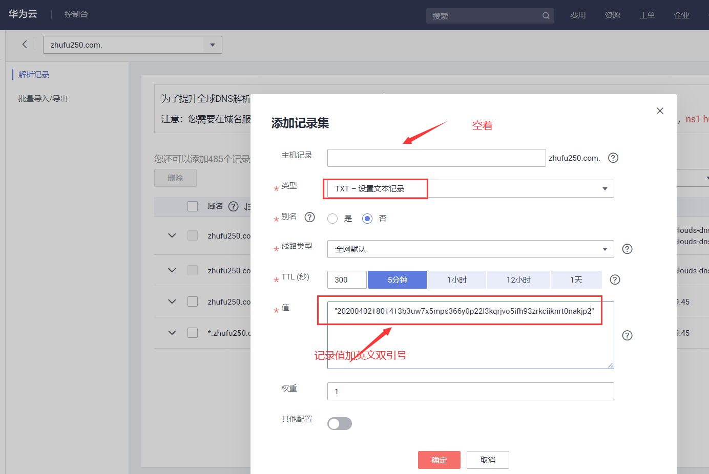
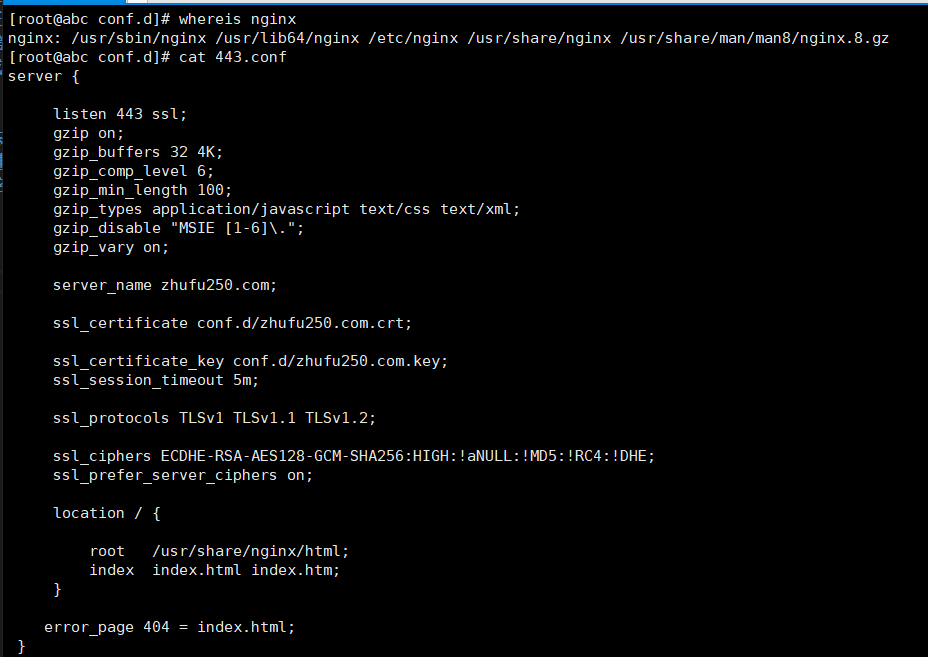
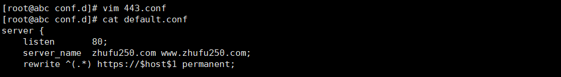

* nginx安装方式很多，选择官网方推荐式安装。[图1](./image/1.png)
* 华为云->控制台搜索“沃通免费SSL证书” 选择免费证书 按提示下单 [图2](./image/2.png)
* 证书进入签发阶段，邮箱收到证书登录地址，修改密码后进入证书系统 [图3](./image/3.png) [图4](./image/4.png)
* 订单列表 -> 补充订单信息 填写域名（zhufu250.com） 勾选 “在线生成”&“DNS” 自己写订单密码 其他按提示. [图5](./image/5.png)
* SSL证书 -> 证书进入域名验证状态 验证方式DNS，复制记录值 [图6](./image/6.png)
* 返回华为云控制台，域名解析，新建TXT域名验证 记录值记得加 ""  
* 等待15分钟（重点），证书系统域名验证自动通过 下载证书 输入订单密码 证书格式选nginx [图8](./image/8.png)

* nginx 配置 ssl ，443开启 gzip压缩(生产环境 静态资源上CDN) ，80端口配置443跳转。顺便做下404跳转  

```
gzip on;
gzip_buffers 32 4K;
gzip_comp_level 6;
gzip_min_length 100;
gzip_types application/javascript text/css text/xml;
gzip_disable "MSIE [1-6]\.";
gzip_vary on;
```

```
rewrite ^(.*) https://$host$1 permanent;
```


```
error_page 可以做主页跳转，    
error_page 404 index.html 此页面http状态码是404  
error_page = index.html 此页面是302跳转。生产可用此配置。 
```


